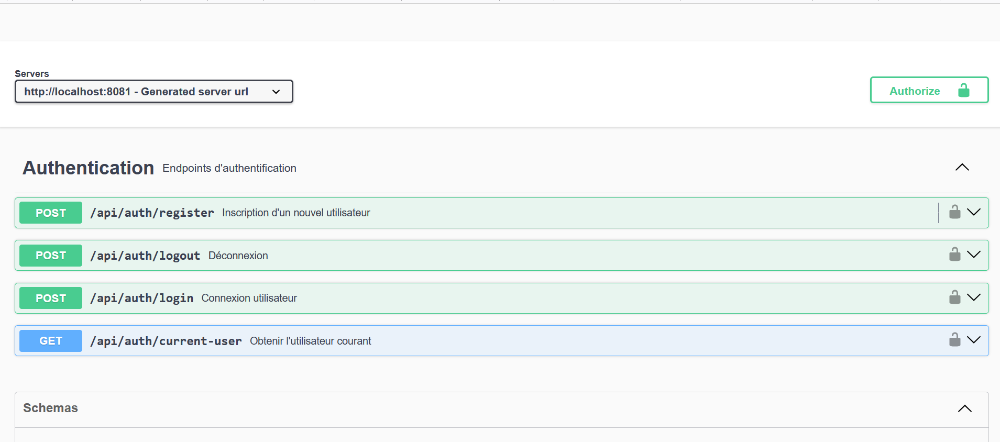

# Spring Boot Starter Auth

Un starter Spring Boot complet pour l'authentification JWT avec gestion des utilisateurs, historique des connexions, confirmation d'email et documentation Swagger UI intégrée.

## 📋 Caractéristiques

- ✅ Authentification JWT complète
- 🔐 Gestion des rôles et autorisations
- 📧 Confirmation d'email et réinitialisation de mot de passe
- 🔒 Verrouillage de compte après tentatives échouées
- 📊 Historique des connexions
- 📝 Documentation Swagger UI automatique
- 🔄 Endpoints REST prêts à l'emploi
- 🛡️ Configuration de sécurité Spring préconfigurée
- 📦 Auto-configuration Spring Boot
- 🎯 Support des bases de données JPA

## 📥 Installation

### Maven

Ajoutez la dépendance suivante à votre `pom.xml` :
```xml
<dependency>
    <groupId>io.github.tky0065</groupId>
    <artifactId>spring-boot-starter-auth</artifactId>
    <version>1.0.4</version>
</dependency>
```

### Gradle
```groovy
implementation 'io.github.tky0065:spring-boot-starter-auth:1.0.4'
```

## ⚙️ Configuration

### Application Properties

```properties
# JWT Configuration
auth.jwt.secret=VotreClefSecrete
auth.jwt.expiration=86400000  # 24 heures en millisecondes

# Base de données
spring.datasource.url=jdbc:h2:mem:testdb
spring.datasource.driverClassName=org.h2.Driver
spring.datasource.username=sa
spring.datasource.password=password
spring.jpa.database-platform=org.hibernate.dialect.H2Dialect

# Email Configuration
spring.mail.host=localhost
spring.mail.port=1025
spring.mail.username=${SMTP_USERNAME}
spring.mail.password=${SMTP_PASSWORD}
spring.mail.properties.mail.smtp.auth=true
spring.mail.properties.mail.smtp.starttls.enable=true

# Application Configuration
app.email.from=noreply@yourdomain.com
app.base-url=http://localhost:8080
app.security.max-failed-attempts=3
app.security.lock-duration-hours=24

# Logging
logging.level.com.enokdev=DEBUG
```

## 🚀 Utilisation

### Endpoints disponibles

#### Authentification
- **POST** `/api/auth/register` - Inscription d'un nouvel utilisateur
  ```json
  {
    "username": "user",
    "email": "user@example.com",
    "password": "password123",
    "firstName": "John",
    "lastName": "Doe"
  }
  ```

- **POST** `/api/auth/login` - Connexion
  ```json
  {
    "username": "user",
    "password": "password123"
  }
  ```
  


#### Gestion du compte
- **GET** `/api/auth/current-user` - Obtenir les informations de l'utilisateur courant
- **POST** `/api/auth/logout` - Déconnexion
- **GET** `/api/auth/confirm-email` - Confirmation d'email
- **POST** `/api/auth/forgot-password` - Demande de réinitialisation de mot de passe
- **POST** `/api/auth/reset-password` - Réinitialisation du mot de passe
- **PUT** `/api/users/{userId}/profile` - Mise à jour du profil
- **GET** `/api/users/{userId}/login-history` - Historique des connexions


## 📖 Documentation API
La documentation Swagger UI est disponible à l'URL :
```
http://votre-serveur:port/swagger-ui.html
```
### 📍 swagger-ui

## 🔧 Personnalisation
### Configuration personnalisée du JWT
Créez une classe de configuration :
```java
@Configuration
public class CustomJwtConfig {
    
    @Bean
    public JwtService customJwtService() {
        return new CustomJwtService();
    }
}
```

### Personnalisation du UserDetailsService
```java
@Service
public class CustomUserDetailsService implements UserDetailsService {
    
    @Override
    public UserDetails loadUserByUsername(String username) {
        // Votre implémentation
    }
}
```
### Modèles de réponse

#### AuthResponse
```json
{
  "token": "eyJhbG...",
  "type": "Bearer",
  "username": "user",
  "roles": ["ROLE_USER"],
  "email": "user@example.com",
  "firstName": "John",
  "lastName": "Doe"
}
```

#### LoginHistoryResponse
```json
{
  "timestamp": "2024-11-24T15:30:00",
  "success": true,
  "ipAddress": "192.168.1.*",
  "userAgent": "Mozilla/5.0...",
  "location": "Ouagadougou, Burkina Faso"
}
```

## 📊 Modèle de données

### User Entity
```java
@Entity
public class User {
    private Long id;
    private String username;
    private String password;
    private String email;
    private String firstName;
    private String lastName;
    private boolean enabled;
    private boolean accountNonLocked;
    private int failedAttempts;
    private LocalDateTime lockTime;
    private String resetToken;
    private LocalDateTime resetTokenExpiry;
    private String emailConfirmationToken;
    private Set<String> roles;
    private List<LoginHistory> loginHistory;
}
```

## 🔒 Fonctionnalités de sécurité

- Verrouillage de compte après 3 tentatives échouées
- Email de confirmation obligatoire
- Réinitialisation sécurisée du mot de passe
- Historique des connexions avec géolocalisation
- Protection contre la force brute
- Tokens JWT avec expiration configurable
- Mots de passe hashés avec BCrypt

## 📧 Templates d'emails

- Confirmation d'inscription
- Réinitialisation de mot de passe
- Notification de verrouillage de compte
- Confirmation de changement de mot de passe

## 🧪 Tests

Pour tester l'application :

1. Démarrer MailHog pour les tests d'email :
```bash
docker run -d -p 1025:1025 -p 8025:8025 mailhog/mailhog
```

2. Accéder à l'interface MailHog :
```
http://localhost:8025
```

3. Console H2 :
```
http://localhost:8080/api/h2-console
```

## 📈 Versions

- **1.0.4**
  - Ajout de la confirmation d'email
  - Ajout du verrouillage de compte
  - Ajout de l'historique des connexions
  - Amélioration de la gestion des tokens

## ⚠️ Notes importantes

- La clé secrète JWT doit être changée en production
- Les templates d'emails sont personnalisables
- Les paramètres de sécurité sont configurables
- L'historique des connexions est automatiquement géré
- Le verrouillage de compte est automatique après 3 échecs

## 🤝 Contribution
Les contributions sont les bienvenues ! Voici comment vous pouvez contribuer :
1. Fork le projet
2. Créez votre branche (`git checkout -b feature/AmazingFeature`)
3. Committez vos changements (`git commit -m 'Add some AmazingFeature'`)
4. Push vers la branche (`git push origin feature/AmazingFeature`)
5. Ouvrez une Pull Request
## 📄 Licence
Distribué sous la licence MIT. Voir `LICENSE` pour plus d'informations.
## ✨ Support
Pour obtenir de l'aide :
- Ouvrez une issue sur GitHub
- Envoyez un email à enokdev.bf@gmail.com
## 🎯 Roadmap

- [ ] Support des réseaux sociaux (OAuth2)
- [ ] Authentification à deux facteurs
- [ ] Support de WebSocket sécurisé
- [ ] Interface d'administration
- [ ] Support de Redis pour le blacklisting des tokens