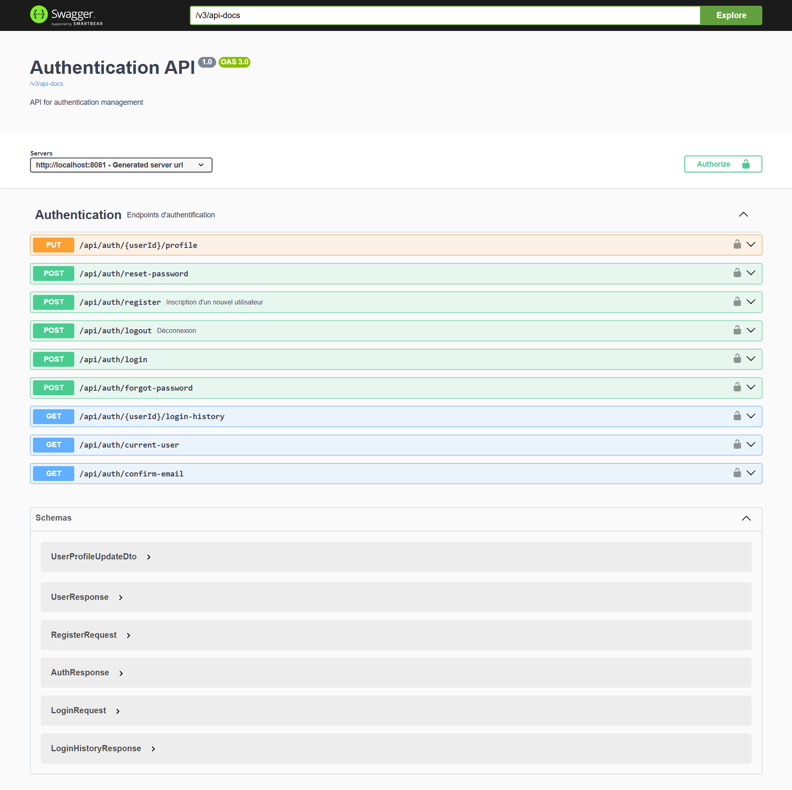

# Spring Boot Starter Auth

Un starter Spring Boot complet pour l'authentification JWT avec gestion des utilisateurs et documentation Swagger UI intégrée.

## 📋 Caractéristiques
  
- ✅ Authentification JWT complète
- 🔐 Gestion des rôles et autorisations
- 📝 Documentation Swagger UI automatique
- 🔄 Endpoints REST prêts à l'emploi
- 🛡️ Configuration de sécurité Spring préconfigurée
- 📦 Auto-configuration Spring Boot
- 🎯 Support des bases de données JPA

## 📥 Installation

### Maven

Ajoutez la dépendance suivante à votre `pom.xml` :

```xml
<dependency>
    <groupId>io.github.tky0065</groupId>
    <artifactId>spring-boot-starter-auth</artifactId>
    <version>1.0.3</version>
</dependency>
```

### Gradle

```groovy
implementation 'io.github.tky0065:spring-boot-starter-auth:1.0.3'
```

## ⚙️ Configuration

### Application Properties

Ajoutez ces propriétés à votre `application.properties` ou `application.yml`:

```properties
# JWT Configuration
auth.jwt.secret=VotreClefSecrete
auth.jwt.expiration=86400000  # 24 heures en millisecondes


# Base de données (exemple avec H2)
spring.datasource.url=jdbc:h2:mem:testdb
spring.datasource.driverClassName=org.h2.Driver
spring.datasource.username=sa
spring.datasource.password=password
spring.jpa.database-platform=org.hibernate.dialect.H2Dialect
```

### Configuration CORS (Optionnel)

Si vous avez besoin de configurer CORS, ajoutez dans votre classe principale :

```java
@Bean
public WebMvcConfigurer corsConfigurer() {
    return new WebMvcConfigurer() {
        @Override
        public void addCorsMappings(CorsRegistry registry) {
            registry.addMapping("/api/**")
                .allowedOrigins("http://localhost:3000")
                .allowedMethods("GET", "POST", "PUT", "DELETE", "OPTIONS")
                .allowedHeaders("*")
                .allowCredentials(true);
        }
    };
}
```

## 🚀 Utilisation

### Endpoints disponibles

#### Authentification
- **POST** `/api/auth/register` - Inscription d'un nouvel utilisateur
  ```json
  {
    "username": "user",
    "email": "user@example.com",
    "password": "password123"
  }
  ```

- **POST** `/api/auth/login` - Connexion
  ```json
  {
    "username": "user",
    "password": "password123"
  }
  ```

- **GET** `/api/auth/current-user` - Obtenir les informations de l'utilisateur courant
- **POST** `/api/auth/logout` - Déconnexion

### Sécurisation des endpoints

Pour sécuriser vos propres endpoints, utilisez les annotations Spring Security :

```java
@RestController
@RequestMapping("/api/secured")
public class SecuredController {

    @GetMapping("/user")
    @PreAuthorize("hasRole('USER')")
    public String userEndpoint() {
        return "Accessible aux utilisateurs";
    }

    @GetMapping("/admin")
    @PreAuthorize("hasRole('ADMIN')")
    public String adminEndpoint() {
        return "Accessible aux administrateurs";
    }
}
```

### Utilisation des tokens JWT

Le token JWT est renvoyé dans la réponse de login. Pour l'utiliser :

```javascript
// Exemple avec Fetch API
fetch('/api/secured/user', {
    headers: {
        'Authorization': 'Bearer ' + token
    }
})
```

## 📖 Documentation API

La documentation Swagger UI est disponible à l'URL :
```
http://votre-serveur:port/swagger-ui.html
```
## 📍 swagger-ui


## 🔧 Personnalisation

### Configuration personnalisée du JWT

Créez une classe de configuration :

```java
@Configuration
public class CustomJwtConfig {
    
    @Bean
    public JwtService customJwtService() {
        return new CustomJwtService();
    }
}
```

### Personnalisation du UserDetailsService

```java
@Service
public class CustomUserDetailsService implements UserDetailsService {
    
    @Override
    public UserDetails loadUserByUsername(String username) {
        // Votre implémentation
    }
}
```

## 📊 Modèle de données

### User Entity
```java
@Entity
public class User {
    @Id
    @GeneratedValue(strategy = GenerationType.IDENTITY)
    private Long id;
    
    @Column(unique = true)
    private String username;
    
    private String password;
    
    @Column(unique = true)
    private String email;
    
    @ElementCollection(fetch = FetchType.EAGER)
    private Set<String> roles = new HashSet<>();
}
```

## 🔒 Sécurité

- Tokens JWT signés et expiration configurable
- Mots de passe hashés avec BCrypt
- Protection CSRF configurée
- Sessions stateless
- Validation des entrées

## 📝 Exemples

### Exemple d'authentification avec curl

```bash
# Inscription
curl -X POST http://localhost:8080/api/auth/register \
  -H "Content-Type: application/json" \
  -d '{"username":"user","email":"user@example.com","password":"password123"}'

# Connexion
curl -X POST http://localhost:8080/api/auth/login \
  -H "Content-Type: application/json" \
  -d '{"username":"user","password":"password123"}'
```

### Exemple avec Spring RestTemplate

```java
RestTemplate restTemplate = new RestTemplate();
HttpHeaders headers = new HttpHeaders();
headers.setBearerAuth(token);

HttpEntity<String> entity = new HttpEntity<>(headers);
ResponseEntity<String> response = restTemplate.exchange(
    "http://localhost:8080/api/secured/user",
    HttpMethod.GET,
    entity,
    String.class
);
```

## 🤝 Contribution

Les contributions sont les bienvenues ! Voici comment vous pouvez contribuer :

1. Fork le projet
2. Créez votre branche (`git checkout -b feature/AmazingFeature`)
3. Committez vos changements (`git commit -m 'Add some AmazingFeature'`)
4. Push vers la branche (`git push origin feature/AmazingFeature`)
5. Ouvrez une Pull Request

## 📄 Licence

Distribué sous la licence MIT. Voir `LICENSE` pour plus d'informations.

## ✨ Support

Pour obtenir de l'aide :
- Ouvrez une issue sur GitHub
- Envoyez un email à enokdev.bf@gmail.com

## 🎯 Roadmap

- [ ] Support des réseaux sociaux (OAuth2)
- [ ] Authentification à deux facteurs
- [ ] Support de WebSocket sécurisé
- [ ] Interface d'administration
- [ ] Support de Redis pour le blacklisting des tokens

## 📦 Versions

- **1.0.3**
    - Authentification JWT de base
    - Gestion des utilisateurs
    - Documentation Swagger

## ⚠️ Notes importantes

- Changez toujours la clé secrète JWT en production
- Configurez correctement CORS pour votre environnement
- Utilisez HTTPS en production
- Effectuez des sauvegardes régulières de la base de données
